# prompt

## 为什么学prompt

首先，需要了解什么是Prompt以及其在自然语言处理中的作用。Prompt(提示词)是一种新兴的机器学习方法，通过在训练数据中嵌入特定的提示来引导模型学习。这种方法的灵感来自于人类的学习过程，在学习新概念时，我们往往会通过问题和提示来加深理解。

如果需要AI生成答案尽可能的准确，就需要使用prompts，通过提供更多的上下文信息，让AI更好地理解问题，从而生成更准确的答案。

## prompt基本技巧

### 技巧1. 增加示例

AI会从示例中学习，然后创作中相似的内容。

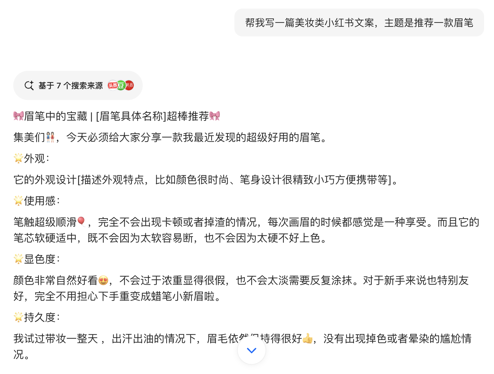
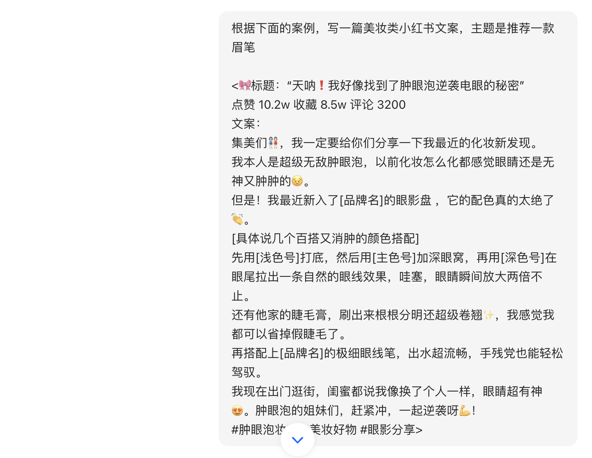
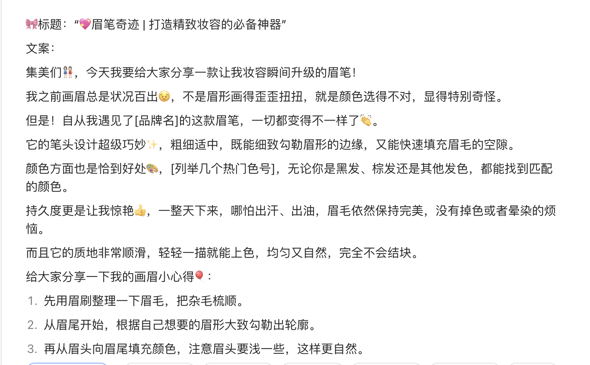

### 技巧2. 增加 Role（角色）或人物

增加角色，可以让模型用更符合角色身份的语言回答问题。

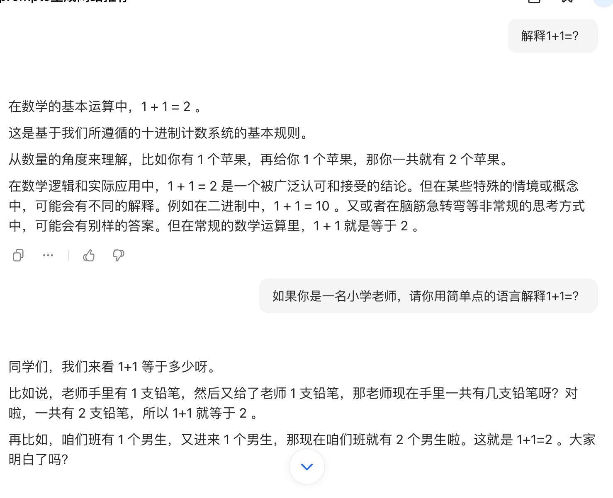

### 技巧3. 使用特殊符号将指令和需要处理的文本分开

例如：``  "" <> `<tag></tag>`

### 技巧4. 通过格式词阐述需要输出的格式

也可以生成特定格式，比如要求模型输出CSV、HTML或者Json格式

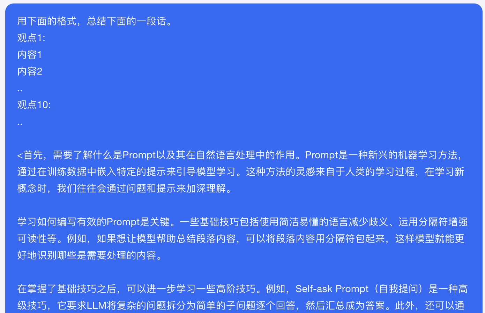

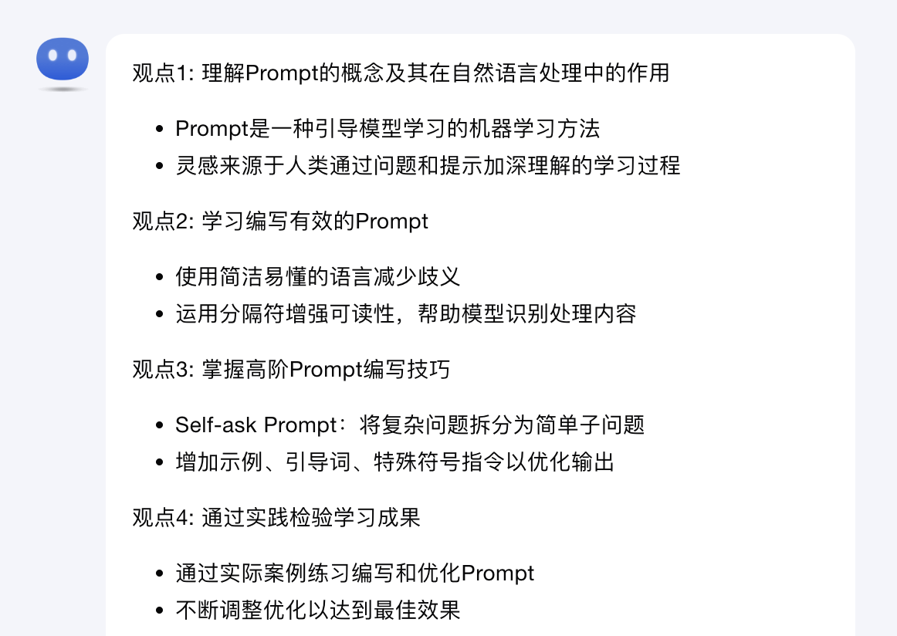

用下面的格式，总结下面的一段话。
观点1:
- 内容1
- 内容2
..
观点n:
.. 

### 技巧5. 给大模型思考的时间，以及足够的时间去完成任务。

1. 指定完成任务的步骤，慢慢引导模型给出正确答案

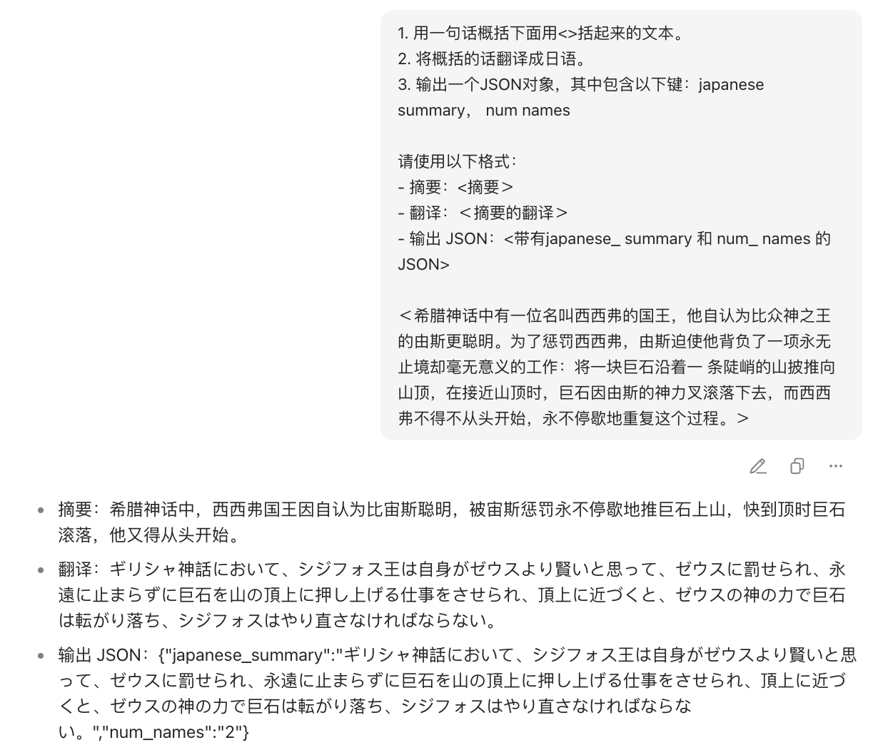

2. 面对比较复杂的问题，在让模型根据信息做出判断前，先引导它尝试给出自己的解决方案。

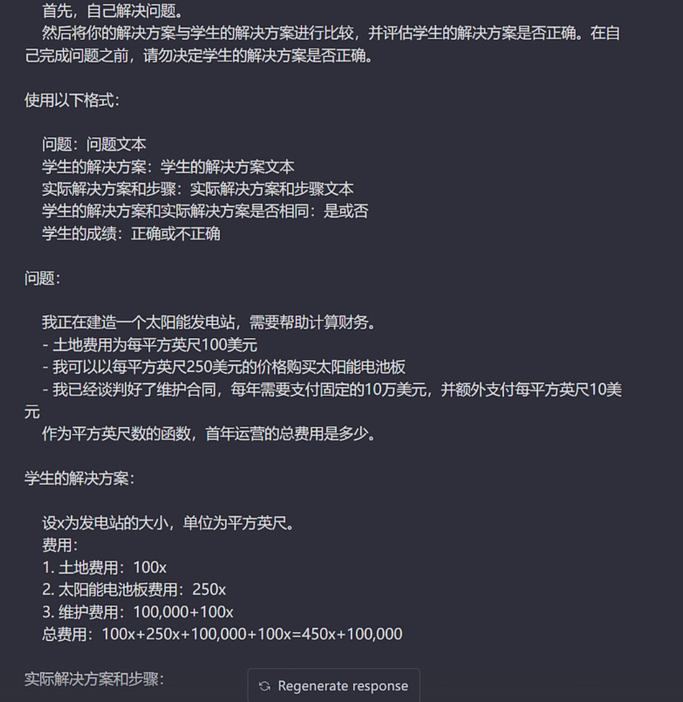

## 技巧的应用

  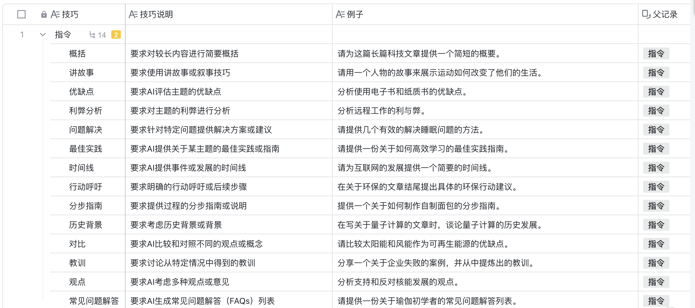
  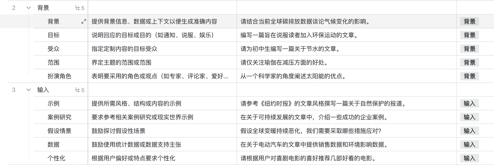
  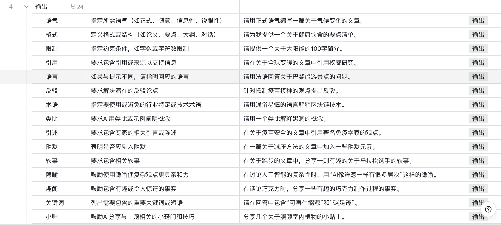
  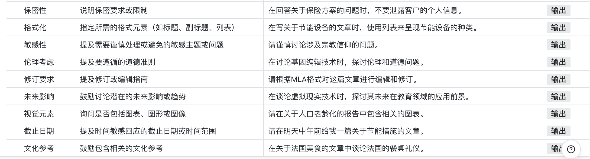

> 图片引用于[waytoagi](https://waytoagi.feishu.cn/wiki/Q5mXww4rriujFFkFQOzc8uIsnah?table=tbljThjDXX4mNdBs&view=vewo2g2ktO)

## 12种prompt框架

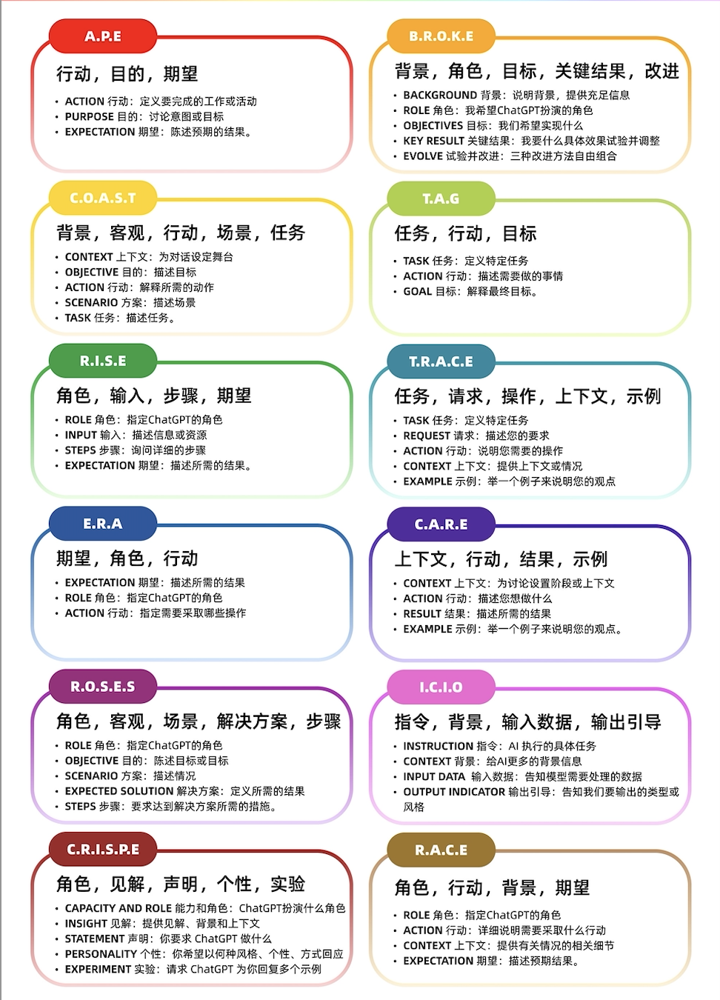

## prompts 生成工具

[flowgpt](https://flowgpt.com/chat/promptenhancer)

[promptperfect](https://promptperfect.jina.ai/interactive)

[月之暗面 Kimi × LangGPT 提示词专家](https://kimi.moonshot.cn/kimiplus/conpg00t7lagbbsfqkq0)

[OpenAI 商店 LangGPT 代码诗人](https://chat.openai.com/g/g-Apzuylaqk-langgpt-dai-ma-shi-ren)

>参考资料:
<https://prompt101.vercel.app/docs/PE-basics/%E6%8F%90%E7%A4%BA%E5%B7%A5%E7%A8%8B%E5%9F%BA%E7%A1%80%E6%8A%80%E5%B7%A7>(需科学上网)
<https://waytoagi.feishu.cn/wiki/HfFbwmpdDiEEwrk8zlWcPIwrn8d>
<https://learningprompt.wiki/zh-Hans/docs/chatGPT/tutorial-basics/brief-introduction>